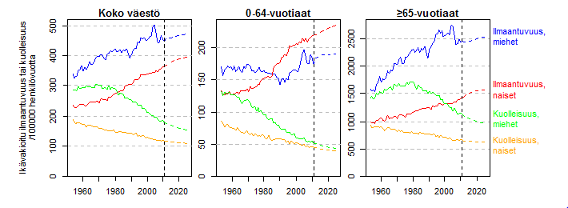
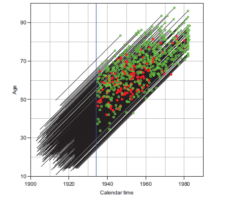
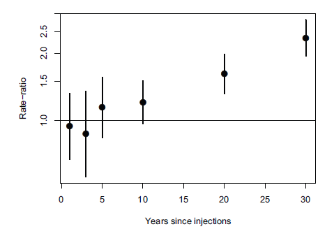

```{r setup, include=FALSE}
knitr::opts_chunk$set(echo = FALSE)
```


## Contents 

-  Basic properties of R
\medskip
- Script files
\medskip
-  Data structures and objects
\medskip
-  Data input and output
\medskip
-  Functions
\medskip
- Tabulation functions

## What is R

-  Statistical software or ''package'' 
    --- and a lot more \medskip
-  R is a **language**and **environment**for
      statistical computing and graphics 
      (\texttt{\small www.r-project.org/}) \medskip
-  Developed by volunteers, coordinated by the
    \textbf{R Development Core Team}. \medskip
-  Available for Windows, Linux, Mac, Unix, \dots. \medskip 
-  Is expanding rapidly: new version every 6 months. \medskip  
-  No licence fee(!) \& source code open. \medskip

For further information and download: {\small\tt http://www.r-project.org/} 

## Properties of R

-  Large repertory of basic and advanced methods. \medskip 
-  Versatile graphics of high quality. \medskip 
-  R Reads datasets from Stata, SAS, SPSS, Epi-Info
 -- \ even Excel \medskip
-  Deals simultaneously with different objects or data structures newline -- not just a single data matrix. \medskip 
-  Results of analysis saved as **objects**, 
     readily available for further processing. \medskip 
-  Parsimonious output listing! \medskip 
-  For advanced users! Easy to expand and tailor to specific needs
    using the **object-oriented**programming tools. 

## To learn more about R

- Hills, M., Plummer, M., Carstensen, B. \newline
*A Short Introduction to R for Epidemiology*, 2011.
\small
 `http://bendixcarstensen.com/Epi/R-intro.pdf`
\normalsize

\medskip
- Dalgaard, P. *Introductory Statistics with R, 2nd Ed.* \newline Springer, New York, 2008.

-  *Statistical Practice in Epidemiology Using R*.
 An international course, IARC, Tarto, 2020.
 \small
\verb|http://bendixcarstensen.com/SPE/|
\normalsize
-  R blog
-  Masses of  books, articles, websites, etc \dots

## What does R offer for epidemiologists?

- Descriptive tools
   + Versatile tabulation
   + High-quality graphics
- Analytic methods
   + Basic epidemiologic statistics
   + Generalized linear models and their extensions
   + Survival analysis methods
   + Other ...

These are provided by SAS and Stata, too, so why R \dots? 

\medskip
Many features of R are more appealing in the long run.

## Graphics in R

- Versatile, flexible, high quality, \dots \medskip
- Easy to add items (points, lines, text, legends \dots) \newline
\medskip to an existing graph. 
\medskip
- Fine tuning of symbols, lines, axes, colours, etc. by \newline
 *graphical parameters*
  ($>$ 67 of them!) 
- Interactive tools using the mouse
   + Put new things on a graph 
   + Identify points 
- Modern lattice or *Trellis* graphics. \medskip
- Saving formats:	Metafile, .pdf, .png, .bmp, .jpg, \dots

## Age-period-cohort incidence in DK


## Cancer Predictions in Finland



## Follow-up of Welsh nickel cohort in Lexis diagram



## RRs & CIs by exposure in a cohort study



## Package or library

- Collection of functions pertaining to some 
    specialized application area, `e.g.`
     *survival, boot*
    \medskip
- Contributed by users of R.
    \medskip
- Available after loading:\newline
	*> library(survival)*
	  \medskip
- Alternatively load from the menu bar: \newline
 {\it Packages - Load package... - Select one} 
   \medskip
-  New versions easily updated from Internet.
(https://www.rdocumentation.org/trends)


## R script -- R Studio -- commands in a file

\ \\
\textbf{R script file} is an ASCII file
containing a sequence of R commands to be executed.

gskip
The **script editor} -- use R-Studio R

- In {\tt R-Studio} open the script editor window: {\it New file - R script}, or when editing an existing {script file}:
 {\it File - Recent Files}, 
\medskip
\medskip    
- Save the {script file}: 
    {\it Save} \emph{e.g.} or     {\it Save As } {\tt *.R}
- Excecute a line {\it Ctrl-Enter}
    


## R script (cont'd)}

 - Paint the lines to be excecuted and {\it Ctrl -Enter} will execute lines.
 \medskip  

- To run a whole script file, write in console window: \\
 {\tt > source("c:/.../mycmds.R", echo=TRUE)}

- The script can also be written and edited by any external editor programs (like Notepad). 


## Data objects of different kinds


-  {\tt vector}: ordered set of similar elements \\ \emph{e.g.}
  real numbers or character sequences,
  \medskip
-  {\tt factor}: categorical variable with levels \\ 
\emph{e.g.}
{\tt gender}, levels: {\tt c(1,2)} or {\tt c('male', 'female')}; 
\medskip
-  {\tt matrix, array}: 2- and k-dimensional tables,
\medskip
-  {\tt data.frame}: ``data matrix'' (more of this soon!),
\medskip
-  {\tt ts}: time series object,
\medskip
-  {\tt list}: sequence of different types of objects.
% -  {\tt function, expression}, \ldots


##Attributes of data objects
\ \\
Functions that extract some key properties
of objects:
 
-  {\tt length( )}: number of elements, 
\medskip
-  {\tt mode( )}: basic type of elements, 
\medskip
-  {\tt dim( )}: dimensions of arrays, matrices
   and data frames,
  \medskip 
-  {\tt str( )}: overall structure, 
\medskip
-  {\tt class( )}: property that determines
 how certain \\
 **generic functions} (\emph{e.g.} 
 {\tt summary(); plot()}) \\
 work when the object is given as argument.
% -  {\tt name}: 


## Data frame -- data matrix


- [Data frame] = a **list** of column vectors

-  Rows correspond to observational units, and \\ columns (same length) refer to variables.
\medskip
-  Column vectors can be \\ {\tt numeric, character} or {\tt logical}
\medskip
-  Columns are \textbf{subobjects} of the data frame. Their \\
names are not directly accessible. Two possibilities:
   + Use ``surname\$firstname'', e.g. {\tt mydata\$var1}, 
   + Place the data frame in the search path at position 2: 
  {\tt attach(mydata)}; then use just ``firstname'': {\tt var1}


## Data frame import from external files


-  Common ASCII files, for example: \newline
 \small 
   read.table("C:/owndir/rfiles/mydata.txt", ... );
   read.table("http://cc.oulu.fi/~tilel/esan.txt",...)
 \normalsize

-  Files with fixed-width format: {\tt read.fwf()};
\medskip
-  Files created in SPSS, SAS, Stata \emph{etc.}: 
functions \\
$\quad$ {\tt read.spss(), read.ssd(), read.dta()}, \emph{etc.} \\
in package {\tt foreign},
 \medskip 
-  Excel-files: either {\tt read.table("clipboard", ...)}, or\\
 $\quad$ (1)\ save the Excel-file in {\tt .csv} or {\tt .txt} format, \\
 $\quad$ (2)\ in R: {\tt read.csv2( )} or {\tt read.table( )}
% -  Files from an Internet-address: function {\tt url( )}.
 \medskip 
-  Relational DBMSs:  several R packages available.


## Data frame import from external files with R

Choose {\it Import Datasets} 

- [1.] {\it from text (base)} for \textbf{text} files
- [2.] {\it from text (readr)} for \textbf{csv} files
\vspace*{0.3cm}
- [3.] {\it from excel} for \textbf{excel} files
\vspace*{0.3cm}
- [4.] {\it from SPSS} for \textbf{spss} files
- [5.] {\it from SAS} for \textbf{sas} files
- [6.] {\it from STATA} for \textbf{stata} files


## Dealing with output

-  The console contents, \emph{i.e.} the flow of input commands and output results 
from the console window, can be \\
$ \ \ - \ \ $ printed on paper: {\it File - Print...} \\
$ \ \ - \ \ $ saved to an ASCII file: {\it File - Save to file...}
\medskip
-  Selected parts can be copied from the console and pasted to an external file.
\medskip
- 
Function {\tt sink("results.txt")} diverts 
all subsequent output to an external text file.
Back to console: {\tt sink()}.
\medskip
-  Choose {it\ New File -- R Markdown} output to MS-Word
\medskip
-  Graphs saved in desired format: {\it File - Save...}  


## R is a functional language


Most computations in R involve the {invocation} or {call} of functions.  They are called by name with a set of arguments separated by commas, \emph{e.g.} `fun(x, y, z) ;` 
  **Function** \newline
  
  - [=] sequence of rules on how to produce 
    desired output: 
   - [ ] **value** of the function, 
    from given input, {\it i.e.} 
   - [ ] **arguments} of the function.
 
 
\emph{Example}: Function {\tt sqrt()} computes square roots:

\medskip
{\tt > x <- c(0,1,2,3,4)  \#} argument vector defined\\
{\tt > sqrt(x)\ \ \ \ \#} call with argument {\tt x}; value printed:\\
{\tt [1] 0.000 1.000 1.414 1.732 2.000}
 
 


## Defining a new function (1)
\ \\
{\it Example}. Function {\tt CIapp} to calculate an approximate confidence interval
 from point estimate ({\tt estim}) 
and std error ({\tt SE}) by formula {\tt estim} $\pm$ $z_{\gamma/2}\ \times$ {\tt SE}. 

\medskip
Defining code (without prompts): \\
\ \\
{\tt CIapp <- function(estim, SE, level = 0.95) \{ \\
 \ \ \ z <- qnorm(1- (1-level)/2 )  \# setting the quantile\\
 \ \ \ lower <- estim - z*SE ; upper <- estim + z*SE  \\
 \ \ \ CIapp <- c(lower, upper)   \\
 \ \ \ CIapp \} 
}

-  **Formal arguments}, here {\tt estim, SE, level}

 
## Calling the new function (1)
% \ \\

-  **Actual arguments}, used in function call: \\
{\tt > CIapp(3, 1, 0.9) \#} 90\% limits: $3 \pm 1.645\times 1$ \\
{\tt $[1]$ 1.355  4.645 }\\
\medskip
    NB! **Positional matching}: order of actual arguments.
    \medskip
-  **Keyword matching}: the order of arguments in the call is 
    irrelevant if the names of formal arguments are  given \\
	{\tt > CIapp(SE=1.0, level=0.90, estim=3)  }
	\medskip
-  If a **default value} for an argument is given in the definition and is OK, it can be omitted in calling \\
{\tt > CIapp(3, 1) \#} 95\% limits: $3 \pm 1.96 \times 1$  \\
{\tt $[1]$ 1.040  4.960 }

 

## Function call & value object

- Simple call: Evaluates the value of the function with given arguments
and prints value items (according to  the print \textbf{method} specific to
  the \textbf{class} of the value object).
  \medskip
- Call of function and assignment of its value to an object.
    
To extract information \& items from the value object, \emph{e.g.} 

-  {\tt str()}: overall structure,
-  {\tt names()}: names of the components,
-  {\tt print()}: selective printing of value items,
-  {\tt summary()}: selective print (not available for all functions).
% -  {\tt plot()}: certain graphical display, -"-    

## Example, function {\tt range()}}

Returns the minimum and maximum values
of a data vector.

{\tt > y <- c(15.3, 10.8, 8.1, 19.5, 5.3)  \#} data vector \\
\medskip
{\tt > range(y) \ \#} simple call with argument {\tt y}\\
{\tt [1]  5.3 19.5}\\
\medskip
{\tt > ra <- range(y) \#} call with assignment of value\\ 
\medskip
{\tt > ra \ \ \   \#} or {\tt print(ra)}, equivalent to simple call\\
{\tt [1]  5.3 19.5}\\
\medskip
{\tt > str(ra) \   \#} structure of the value object\\
{\tt num [1:2] 5.3 19.5}\\
\medskip
{\tt > ra[1]  \ \ \#} extracting an item from the value object\\
{\tt [1] 5.3}
 


## Different kinds of functions

-  Mathematical, \emph{e.g.} {\tt sqrt(x); log(x); exp(x)}.\\
Arguments and values typically numeric vectors.
\medskip
- 
Data handling, \emph{e.g.} \\
{\tt dafr <- data.frame(x, y); \\
adata <- read.table("a.dat", header=T, ...); \\ % 
redc1 <- subset(redc, group == "24 h");}\\
Main argument(s): data object(s). Value: data object.
\medskip
-  
Graphical, \emph{e.g.} \\
{\tt plot(y $\sim$ x); stripchart(y, xlim=c(0,3))} \\  
Main argument(s): data object(s). Value: graph. \\
Ancillary arguments: \emph{e.g.} graphical parameters.

 


## Value of the function

-  numeric object (\emph{e.g.} vector, matrix) for many \\
  mathematical and statistical functions,
  \medskip
-  data object (e.g. vector, data frame) for \\ data handling functions,
\medskip
-  graph for graphical functions,
\medskip
-  table for tabulating functions,
\medskip
-  **list} = a sequence of objects of different kinds, for \\
many statistical functions.

 

## Statistical functions

-    {\it Main} argument(s): Typically data object(s). \\
        Often a {\it model formula}
        like {\tt y $\sim$ x} with \\ {\tt y} representing 
        the \emph{response} variable and \\
        expression {\tt x} = \emph{explanatory} variable(s) or factor(s).
        \medskip
- 
  \emph{Ancillary} arguments or \emph{parameters}: additional specifications.
    Some default values usually offered for these.
    \medskip
- 
  {\it Value}: Usually a {list} object consisting of several
  components of different types. %-- Note however graphics functions.

%    Example (ks. vanha luentomoniste, t.test)
 

## Function values as list objects

-  **List** = object consisting of an ordered collection of component objects, 
maybe of different types.
\medskip
- 
Provides a convenient way to return the \\
results of statistical computation.
\medskip
- 
A list with named components formed from existing objects: \\
\small 
${ }\quad $ {\small\tt Lista <- list(name=obj1,title=obj2,addr=obj3)} \\
\normalsize
A single component identified: \\
${ } \quad$ {\small\tt Lista{\$}name};
\medskip
- 
Concatenation of several lists into one: \\
${ }\quad$ \small  {\tt longlist <- c(list1, list2, \dots)}.
\normalsize

 
## Ex: Function *t.test()*

\ \\
Description of syntax in the {\tt help()} page
\small
Default S3 method:
t.test(x, y = NULL,
  alternative = c("two.sided", "less", "greater"), mu = 0,
  paired = FALSE, var.equal = FALSE, conf.level = 0.95, ...)
     
  t.test(formula, data, subset, na.action, ...)
\normalsize
\begin{itemize}
- 
Main argument(s): data vector(s) {\tt x} (and {\tt y}) or formula
- 
Ancillary arguments, like {\tt var.equal, conf.level}: \\
Default values given. 
- 
**NB.} Dots '{\tt ...}'


## Example. Red cell folate levels

 The data describe red cell folate levels (variable \texttt{folate}, $\mu$g/l) in two groups  
of cardiac bypass surgery patients given two different 
nitrous oxide ventilation (50\% NO + 50\% O$_2$) treatments
(variable \texttt{group}):

- group 1 ($n_1 = 8$) continuously for 24 h (label \texttt{"24 h"}),
- group 2 ($n_2 = 9$) only during the operation (\texttt{"oper"}).

Observed folate levels in the two groups:
> folate[group=="24 h"]
[1] 243 251 275 292 347 354 380 392
> folate[group=="oper"]
[1] 206 210 226 249 255 273 285 295 309


## Ex: Call of {\tt t.test()} by \emph{formula} argument

\small
> t.test(folate ~ group, var.equal=TRUE, conf.level=0.9)

\normalsize

Output:
\scriptsize 

        Two Sample t-test
data:  folate by group 
t = 2.5653, df = 15, p-value = 0.02153

alternative hypothesis: true difference in means is not equal to 0 

90 percent confidence interval:
  19.09502 101.51610 
  
sample estimates:
mean in group 24 h mean in group oper 
          316.7500           256.4444 
\normalsize
 


## Ex: Value returned by {\tt t.test()} is a \emph{list}}

\ \\
Function value assigned to an object and examined:
\small
> tfol <- t.test(folate ~ group, var.equal=TRUE, 
+      conf.level=0.9) 
> str(tfol)  # The structure of the object

\normalsize
{\scriptsize
List of 9
 $ statistic  : Named num 2.57
  ..- attr(*, "names")= chr "t"
 $ parameter  : Named num 15
  ..- attr(*, "names")= chr "df"
 $ p.value    : num 0.0215
 $ conf.int   : atomic [1:2]  19.1 101.5
  ..- attr(*, "conf.level")= num 0.9
 $ estimate   : Named num [1:2] 317 256
  ..- attr(*, "names")= chr [1:2] "mean in group 24 h" "mean in group oper"
 $ null.value : Named num 0
  ..- attr(*, "names")= chr "difference in means"
 $ alternative: chr "two.sided"
 $ method     : chr " Two Sample t-test"
 $ data.name  : chr "folate by group"
 - attr(*, "class")= chr "htest"

> names(tfol)
[1] "statistic"   "parameter"   "p.value"     "conf.int"    "estimate"   
[6] "null.value"  "alternative" "method"      "data.name"  


## Ex: Value of {\tt t.test()} utilized}


- Extracting items for further processing: 
\footnotesize
> tfol$estimate  # contents of the 'estimate' component
mean in group 24 h mean in group oper
          316.7500           256.4444 
\normalsize
\medskip
- 
Utilizing the component value in further calculations:
\small

> mean.diff <- tfol$estimate[1] - 
               tfol$estimate[2] 
\normalsize 
\medskip
- 
Item names in the parent object ``inherited''. Can be renamed:
\small 

> names(mean.diff) <- c("Mean difference") ; mean.diff 
Mean difference
       60.30556 

\normalsize
 

## Defining a new function (2)}

We now create a new function {\tt T.estimCI()}. It will return
 only the mean difference between the groups (which is not reported by {\tt t.test()}!) and its confidence interval.
 
\medskip
The function is defined as follows: 
 
T.estimCI <- function(x, ... )
 { tt <- t.test(x, ...)
   mean.diff <- tt$estimate[1] - tt$estimate[2]
   names(mean.diff) <- c("Mean difference")
   T.estimCI <- list(Meandiff = mean.diff, 
                 Conflimits = tt$conf.int)
   T.estimCI }  


## Calling the new function (2)

\ \\
When {\tt t.estimCI()} is called, 
a list with 2 named components is returned and printed:
\small
> T.estimCI(folate ~ group, var.equal=T, conf.level=0.9)
\small

$Meandiff
Mean difference 
       60.30556 
$Conflimits
[1]     19.09502 101.51610
attr(,"conf.level")
[1] 0.90

## Dealing with functions


-  Defining code can (mostly) be viewed by typing the function name  without parentheses and arguments.
  \medskip
-  Functions can be saved into a separate script 
 or source file, {\it e.g.} {\tt myfuns.R}, 
   which may contain several functions.
   \medskip
-  Source file accessible in an R run after \\
	{\tt > source("C:/\dots/myfuns.R") } 
	\medskip
-  Alternatively from menu bar: {\it File -- Source R code \dots} 
\medskip
-  Loading from Internet:\\
{\tt > source("http://.../myfuns.R")}

 
## Tabulation functions


-  {\tt table(c1, c2)}: simple contingency tables
-  {\tt xtabs( )}: more elaborate tabulation features 
-  {\tt ftable(c1, c2, c3)}: "flat" contingency tables 
% -  {\tt apply( )} for e.g. calculating margins in a cont. table 
% -  {\tt sweep( )} for e.g. calculating percentages
% in table cells
-  {\tt tapply(var,fac,fun)} tabulates values of function 
{\tt fun()} (for example {\tt mean()}) 
applied to values of variable {\tt var} in categories of factor 
{\tt fac},
-  {\tt stat.table( index = list(rvar, cvar)}, \\
$\ \ { } \ \ $ 
{\tt contents = list(count(), percent(rvar) )}, \\
$\ \ { } \ \ $ {\tt ... )} \\
 in package {\tt Epi} for more informative tabulation.
-  package plyr and ddply-funtion \dots
-  package data.table for BIG data \dots
-  missing variables...
-  other \dots

 

